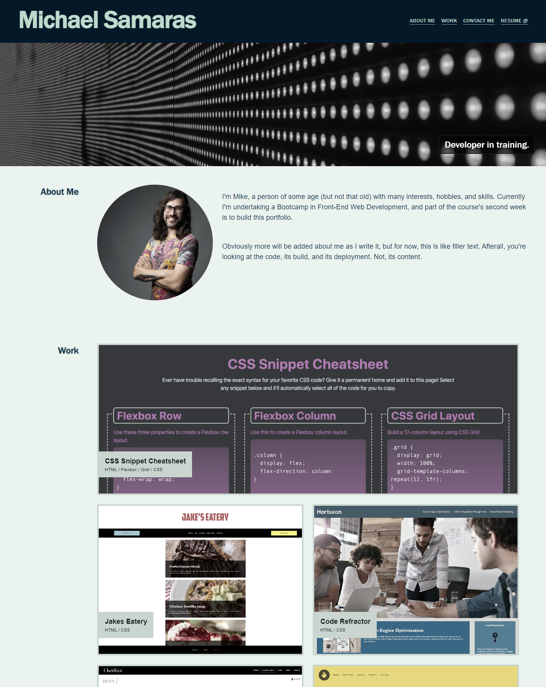

# Portfolio-Project-Week-2

## Description

Module 2 challenge. Working with CSS to create a responsive and working portfolio website, with internal and external links.

### User Story

To put into practice the first 2 weeks of the Bootcamp, and pushing our understanding of the processes, code, and application of CSS, HTML and Git. 

### Acceptance Crieteria

* To present a fully working webpage, presenting my name, a recent photo, and links to sections about me, my work, and how to contact me
* To set anchor points within the page
* To present titled images of my applications
* To present my first application as bigger than the others
* When applications are clicked to take the user to the deployed website
* To present a responsive webpage that works on multiple screen dimensions
* To deploy at live URL
* To load with no errors
* To submit GitHub URL
* To ensure GitHub repo includes application code
* Application resemble the mock-up functionality as shown in the Challenge instructions
* To ensure the repo has a unique name
* Repo follows best practice for file structure and naming conventions
* Repo contains multiple commit messages
* Repo contains README.md with description, screenshot, and working link to deployed application

### Deployed Application

View the deployed application for week-2: responsive-portfolio-lesson at [makemassair.github.io](https://makemassair.github.io/Portfolio-Project-Week-2/).

### Screenshot

